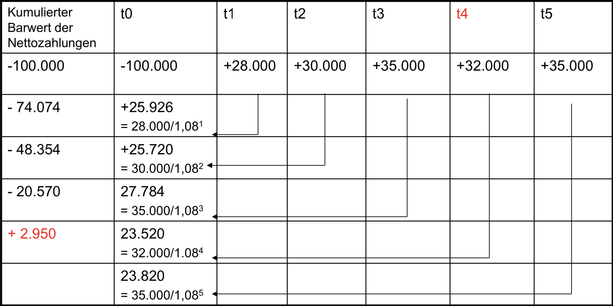
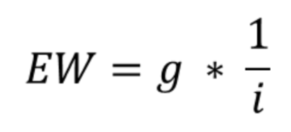
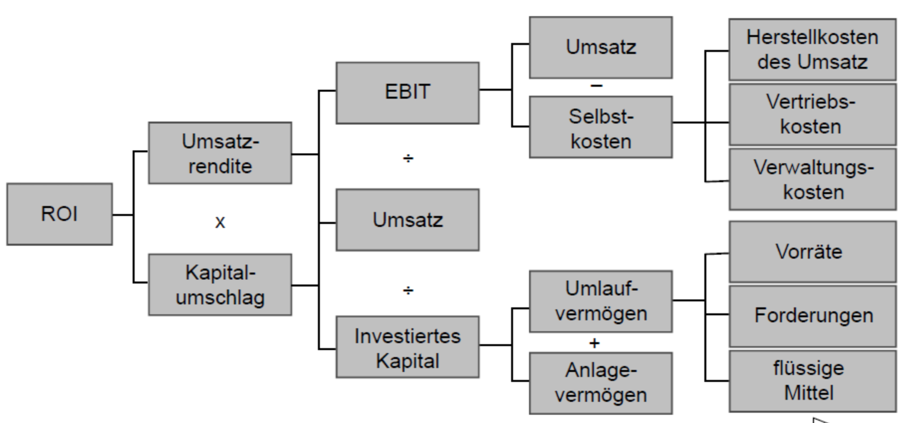
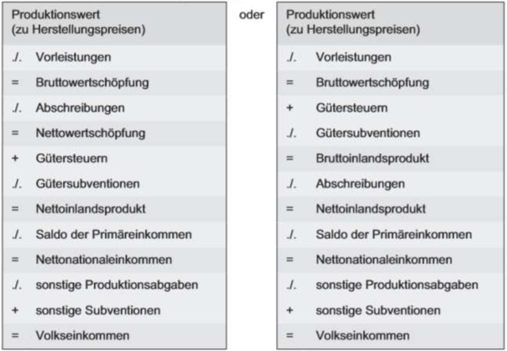

# Schwerpunkte zum Lernen - Teil BWL

- Multiple Choice Teil (richtig/falsch)
  - Marketing
- Rechnungsteil
  - Alle Kennzahlen
    - EBIT
    - Rentabilität
    - Annuität
    - Cash Flow
    - Ertragswerte

## Rechnungsteil

Dieser Abschnitt enthält alle Formeln zu auswenig lernen. Viel Spaß 🤮

### Grundlagen Rechnungswesen


### Liquidität


### Anlagendeckungsgrad


### Cash Flow

```text
  Jahresüberschuss (NACH-STEUER-GRÖßE)
+ Abschreibungen
- Zuschreibungen
+ Delta zum Vorjahr der langfr. Rückstellungen (in Betriebsergebnis)
----------
  Netto Cash Flow (weil JÜ nach Steuer ist)

  Netto Cash Flow
+ Steuern
----------
  Brutto Cash Flow (weil mit Steuer verrechnet)

  Netto Cash Flow
+ außergewöhnliche Aufwände
- außergewöhnliche Erträge
----------
  Operating Cash Flow

  Operating Cash Flow
- Ersatzinvestitionen (zukünftig geplant)
- Erweiterungsinvestitionen (zukünftig geplant)
+ Delta Working Capital (Arbeitendes Kapital)
----------
  Free Cash Flow
```

### EBITDA

```text
E = Earnings
B = Before
I = Interests
T = Taxes
D = Depreciation (="klassische" Abschreibungen)
A = Amortization (=Abschreibungen auf Vermögensgegenstände, die im internationalem
Rechnungswesen angesetzt werden dürfen)
```

- Earning Before Taxes
  - Jahresüberschuss vor Steuern

  - ```text
      Jahresüberschuss
    + Steuern von Einkommen und Ertrag
    ------------
      EBT
    ```

- Earnings Before Interests and Taxes
  - Jahresüberschuss vor Steuern und Zinsen

  - ```text
      EBT
    + Zinsaufwendugnen
    + Zinserträge
    ------------
      EBIT = Ergebnis der gewöhnlichen Geschäftstätigkeit
    ```

- Earnings Before Interests, Taxes and Amortization
  - Jahresüberschuss vor Steuern und Zinsen

  - ```text
      EBIT
    + Abschreibungen aus immaterialle Vermögensgegenstände, insbesondere Geschäfts- oder Firmenwert (nicht in dtl.)
    ------------
      EBITA
    ```

- Earnings Before Interests, Taxes, Depreciation and Amortization
  - Jahresüberschuss vor Steuern und Zinsen

  - ```text
      EBITA
    + Abschreibungen auf Sachanlagevermögen
    ------------
      EBITDA
    ```

- EBIT is gängige Größe um Perfocmance eines Unternehmens zu bewerten
- Warum gibt es mehr als EBT?
  - EBT wird genutzt, um steuersystemunabhängige Vergleiche anzustellen
  - EBIT wird genutzt, um finanzstrukturunabhängige Vergleiche anzustellen
    - In den USA ist es normal, dass Privatpersonen am EK an Unternehmen teilhaben.
    - FK hat Steuervorteil gegenüber EK
    - Europäische Unternehmen haben Steuervorteil gegenüber USA, weil diese höhere FK zu EK haben
  - EBITA wird genutzt, um rechnungslegungssystemunabhängige Vergleiche anzustellen
    - USA erlauben immaterielle Abschreibungen
    - Deutschland nicht
    - Muss neutralisiert werden, damit vergleichbar ist
  - EBITDA wird genutzt, um branchenübergreifende Vergleiche anzustellen
    - Lufthansa hat riesige Abschreibungen, weil Flugzeuge teuer sind
    - FOM hat geringere Abschreibungen, weil Rechner und Gebäude nicht so teuer sind (im Vergleich)
    - ==> Ist ein eher theoretisches Konzept

### Rentabilitäten

#### Eigenkapital-Rentabilität


#### Gesamtkapital-Rentabilität


Zinsen werden hinzugefügt, weil Fremdkapital die Zinsen beinhaltet und diese
durch die Addition bereinigt werden.

#### Betriebsrentabilität & Betriebsnotwendiges Vermögen


#### Umsatzrendite


oder


### Investition

#### Statische Amortisation

Bei der statischen Amortisation wird nicht abgezinst.

$$Amortisationszeit = \frac{Anschaffungskosten}{durchschnittliche\ Erlöse\ pro\ Jahr}$$

#### Dynamische Amortisation

Ähnlich der statischen Amortisation, nur dass hier abgezinst wird. Der Zinssatz
ist davon abhängig, wie viel Geld wir durch andere Investitionen erwarten würden
(Im ersten Semester wird dieser Wert vorgegeben - 8% ist ein guter Richtwert).



#### Kapitalwertmethode


### Finanzierung

#### Annuitätendarlehnen


#### Berechnung für die Kosten von Nichtausnutzung des Skontos


### Aktienkurse / Ertragswertkurse

#### Begrenzte Lebensdauer und ungleiche Nettoeinzahlungen

Für die Berechnung von Anteilen, die man bis drei Jahre plant zu haben.


#### Begrenzte Lebensdauer und gleiche Nettoeinzahlungen

Für Berechnungen von Anteilen, die man zwischen drei und 10 Jahren plant zu haben.


#### Ungebrenzte Lebensdauer und gleiche Nettoeinzahlungen

Für Berechnungen von Anteilen, die man über 10 Jahren plant zu haben.



#### Mittelkurs nach ausgabe neuer Aktien


#### Rechnerischer Wert des Bezugsrechtes


### Risiken

Generelle Formel:

$$Risiko = Eintrittswahrscheinlichkeit\cdot Kosten\ bei\ Eintritt$$

#### ROI-Schema




#### Leverage Effekt


### VWL

#### Preiselastizität


#### Kreuzpreiselastizität


#### Volkswirtschaftliche Gesamtrechnung

##### Entstehungsrechnung



##### Verwendungsrechnung

BIP(Y) = Konsum(C) + Staatskonsum(G) + Investitionen(I) + Nettoexporte(NX)

#### Verschiedene Quoten

Staatsquote = G / Y
Investitionsquote = I / Y
Exportquote = X / Y
Importquote = Im / Y
Nettoexportquote = NX / Y
Konsumquote = C / Y

#### BIP Deflator


