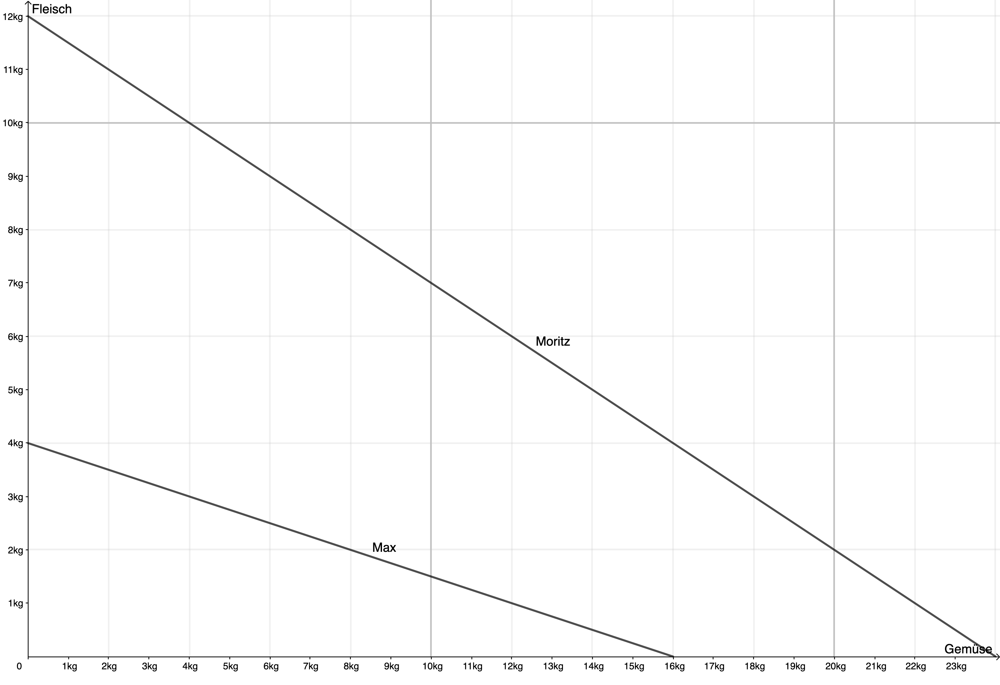

# Management Basics - Teil VWL

Vorlesung vom *2020-01-04*.

Von *Prof. Dr. Christina Wilke*.

## Vorstellung & Grundsätzliches

- In der Prüfung ist VWL 15 von 90 Punkten
- Machen während der Vorlesungen Prüfungsaufgaben
- Letzte Vorlesung ist reine Wiederholung
- Zu den 4 Vorlesungen braucht man nicht viel Literatur, für weitere
  Informationen die drei Bücher aus dem Literaturverweis in Kapitel 10.1, Seite 5

## VWL Grundsätze

### Sektoren

Wird in der letzten Vorlesung noch besprochen

- Landwirtschaft
- ???
- ???
- Dienstleistungen
- andere Dienstleistungen

## Maslowsche Bedürfnispyramide

Verschiedene Arten der Bedürfnisse

Bedprfnisse sind Empfingungen eines Mangels

Alle Menschen versuchen die Bedürfnisse zu befriedigen

An der Pyramide kann man folgendes erkennen:

- Zunächst muss die Basis stehen, bevor die höheren Schichten als Bedürfnis
  latent werden
- Je höher desto weniger quanitativ, dafür aber qualitativ hoch

### Beispiele an eigenem Unternehmen

- Grundbedürfnisse
  - Beheizte Büros
  - Überhaupt Büros
  - Getränke
- Sicherheitsbedürfnisse
  - Fester Arbeitsvertrag
  - Unfall und Arbeitsschutz
  - Betriebliche Altersvorsorge
  - Soziale Sicherungssysteme
- Soziale Bedürfnisse
  - Pausenräume
  - Teamevents, wie Weihnachtsfeiern, Kohlfahren, ...
- Wertschätzungsbedürfnisse
  - Gehaltserhöhungen, Boni, Geschenke
  - Lob, Feedback
  - Firmenwagen
- Entwicklungsbedürfnisse
  - Weiterbildungen, wie Studium oder Schlungen und Zertifikate
  - Mitbestimmugnsrecht, wie Betriebsräte
  - flexible Arbeitszeiten

### VWL Sicht

Ökomonen nehmen an, dass alle Bedürfnisse durch Güter befriedigt werden kann

## Güterarten

- Freie Güter
  - Bsp. Luft, Sonne
- Knappe Güter
  - Absolut Knappe Güter
    - Bsp. Fossile Brennstoffe, Wasser, andere natürliche Ressourcen
  - Relativ Knappe Güter
    - Entstehen durch Angebot und Nachfrage
    - Produktionsgüter
      - Perspektive aus den Unternehmen
    - Konsumgüter
      - Perspektive aus dem Haushalt
    - Gebrauchtsgüter
      - Können mehrfach verwendet werden
    - Verbrauchsgüter
      - Sind nur einmal zu verwenden

Die Bedürfnisse sind unbegrenzt, die Güter aber nicht

==> Spannungsfeld durch Güterknappheit

Spannung wird durch ökonomisches Prinzip "gelöst"

## Ökonomisches Prinzip

Möglichst hohe Effizient erreichen

Minimal Prinzip:
> Output is fix, möglichst wenig Input

Maximal Prinzip:
> Input is fix, Output möglichst hoch

## Effizient vs. Effektivität

Effizienz = Wirtschaftlichkeit

Effektivität = Wirksamkeit

## Zusammenhang BWL und VWL

BWL ist die Wirtschaftswissenschaft eines einzelnen Betriebs

VWL ist die Wirtschaftswissenschaft einer oder mehrerer Nationen

Spektrum von BWL -> Mikroökonomie -> Makroökonomie -> VWL

==> BWL und VWL sind manchmal nicht genau zu trennen

## Wirtschaften und Trade-Offs

Erste Implikation aus der Güterknappheit

Jedes Mal, wenn man ein Bedürfnis befriedigt, wird ein anderes vernachlässigt

Jeder Entscheidung hat einen TradeOff

Milton Friedman

> There is no such thing as a free lunch.

Selbst, wenn etwas kostenlos ist, muss man ein anderes Bedürfnis
vernachlässigen (Was immer man in der Zeit hätte machen können)

Enscheidung zu treffen bedeutet, die Erreichung eines Ziels gegen die Erreichung
eines anderen Ziels abzuwägen

### Beispiele von TradeOffs

> Effizienz vs. Gleichheit

Wenn alles gleich behandelt wird, wenn unterschiedliche Leistungen eingeflossen
sind, wird die Effizient niedriger

## Oppotunitätskosten

Bezifferung der Kosten, die entstehen, wenn man sich für die eine
Bedürfnisbefriedigung und nicht die andere entscheidet.

### Beispiele

- Geld ausgeben *oder* die Sicherheit haben, dass man
   im Notfall Geld hat

## Theorie des komparativen Kostenvorteils

Idee: Arbeitsteilung

--> Produktionskurve / Transfomrationskurve

> Moritz hat einen komparetiven Kostenvorteil bei der Fleischproduktion.
>
> Max hat einen komparativen Kostenvorteil bei der Gemüseproduktion.

Vorteil: Arbeitsteilung (auch zwischen Nationen) kann hilfreich sein, obwohl eine Partei
absolut ineffizienter ist. Daher ist der globale Handel gut für die Gesamtwirtschaft.

Nachteile: Von der Spezilaisierung haben wir Abhängigkeiten, Die Verteilung der
resultirernden Güter kann immer noch ungerecht/ungleich sein
